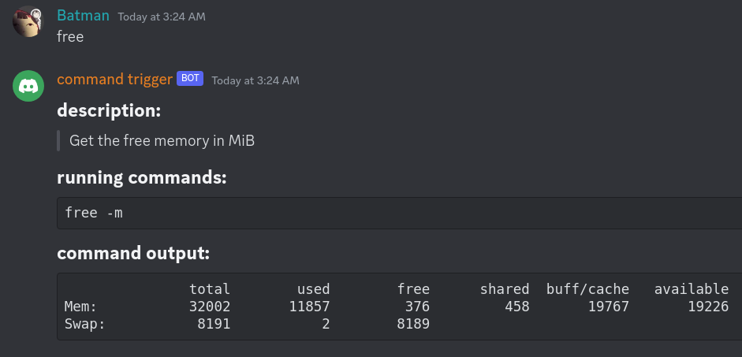
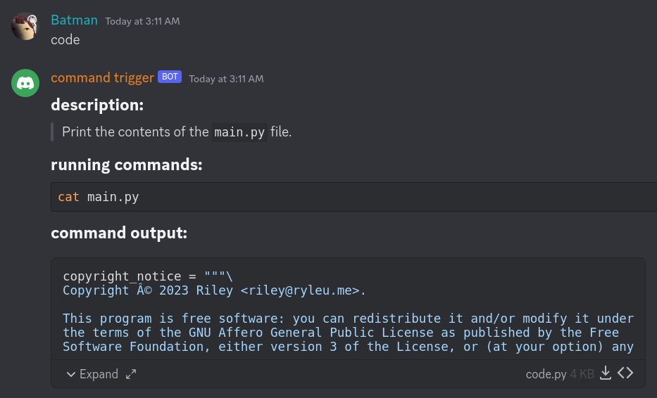

# Command Trigger

Safely run commands on a remote machine using Discord!

Command Trigger works by using a list of pre-made "flows" (lists of commands to
be run sequentially) that you can then trigger with a message in Discord.



## Use
To use this project, you must create a bot at
<https://discord.com/developers/applications>.

Command Trigger also uses [Poetry](https://python-poetry.org/). You can run it with
this command:

```sh
poetry run python main.py
```

## Config File
The config file contains the authorized users (`owner_ids`), the authorized
channels (`channel_ids`), the bot's authorization token (`token`), and the max
length the command output can be before being uploaded as a file
(`max_codeblock_length`).

The format is as follows:

`config.json`:
```json
{
  "token": "token here",
  "owner_ids": [
    587967909641584661,
    600130839870963725
  ],
  "channel_ids": [
    795651596709003295
  ],
  "max_codeblock_length": 1000
}
```

## Flows
A flow is made of four main components: the name, the description, the steps,
and the output format. The `flows.json` file works as follows, replacing things
in angle brackets with proper data:

```json
{
    "<name>": {
        "description": "<description>",
        "steps": [
            "<step 1>",
            "<step 2>"
        ],
        "format": "<format>"
    }
}
```

The keys `description` and `format` are optional, defaulting to
`*No description.*` and `ansi`, respectively. Using `discord` for the `format`
key will result in no code block, leaving it up to Discord how things are
rendered.

The commands in `steps` will be combined by inserting a semi-colon between each
command to make it into a one-liner. Please keep this in mind when writing
flows!

A few example flows already exist in `flows.json`.

## Output
Immediately after sending a trigger message, the bot will respond with a
confirmation message including the name of the flow, the description, and the
steps in said flow.

After executing the commands, the bot will send a message containing the command
`stdout`. If the `stdout` is greater than the length defined in `config.json` by
`max_codeblock_length`, the `stdout` will be uploaded as a file. If `stderr` has
any value, it will be uploaded as a file.


